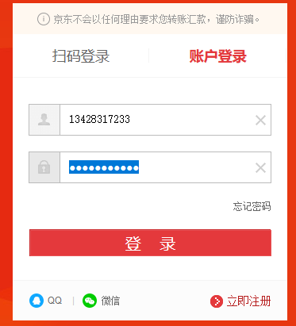
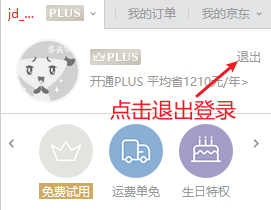
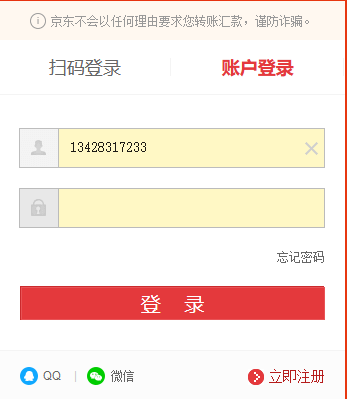
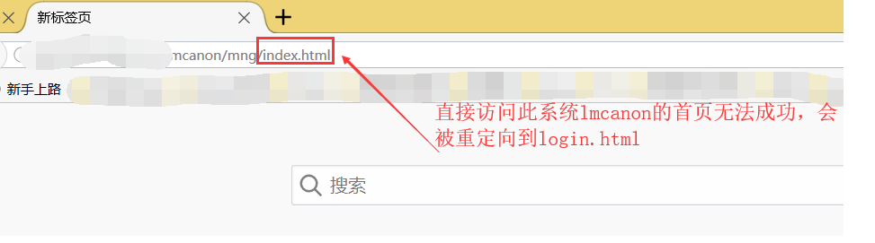
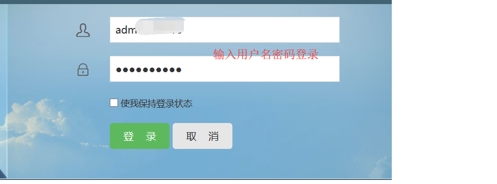
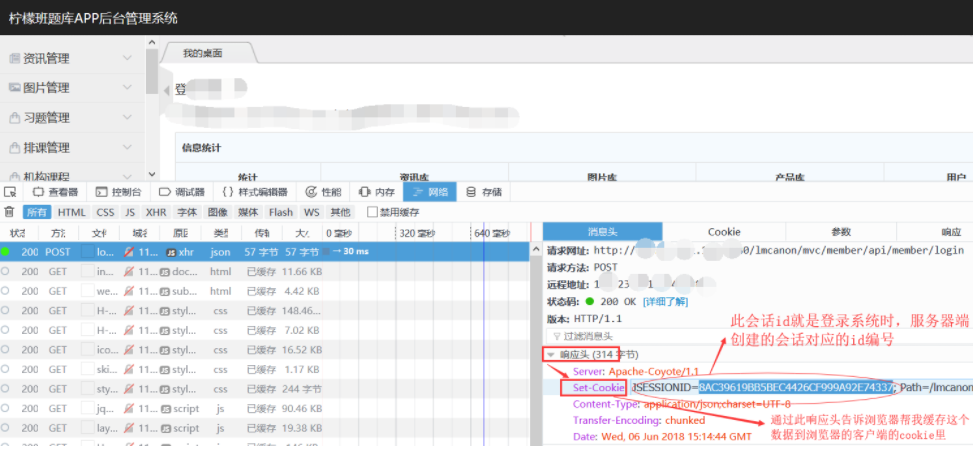
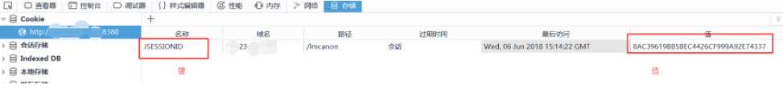
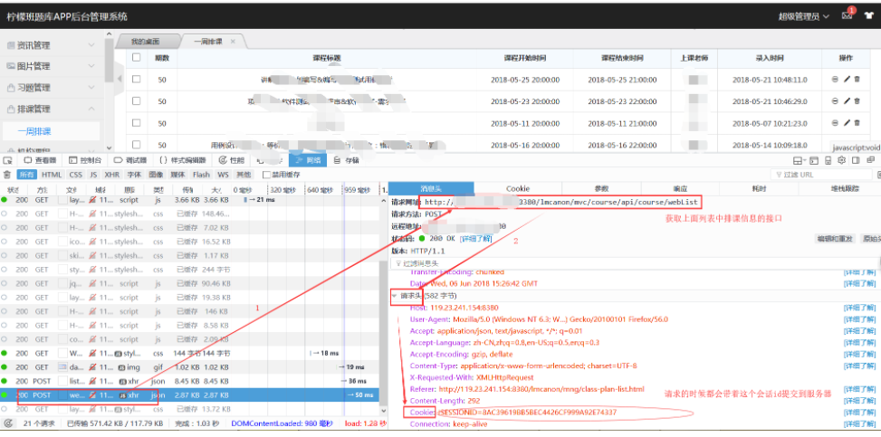
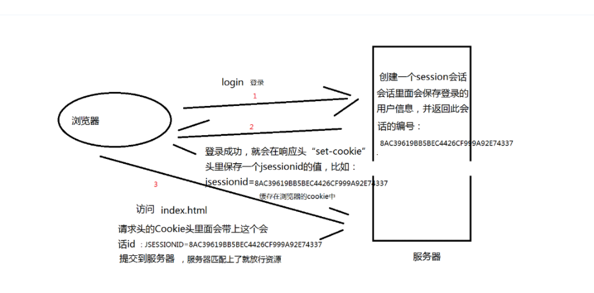

# Cookie、Session及Token实例

# 一、Cookie

## 1. 特点

- Cookie是一门**客户端缓存技术**
- Cookie数据由服务器生成，发送给浏览器保存
- Cookie数据的格式：键值对
- Cookie数据过期机制：设置expire值

Cookie是一门客户端技术，一般是由服务器生成返回给浏览器客户端来保存的，并且cookie是以键值对的形式保存在浏览器客户端的，每一个cookie都会有名称，值，过期时间。cookie有很多使用场景，在项目中比较常见的有：

1. **登录记住用户名**
2. **记录用户浏览记录**

## 2. 实例

以京东网站的登录功能为例，当我们登录了一次京东，后面再去登录页面登录的时候，会发现它会帮你回填之前的用户名，这个场景就是通过cookie技术实现的。

1. 打开火狐浏览器，访问京东登录页面输入登录账号，密码完成登录

2. 首页退出登录

3. 登录页面再次登录发现用户名输入框已经回填了之前的手机号：

   

4. F12打开火狐浏览器找到保存手机号的这个cookie：“mp”，值就是我们填写的用户名信息：

   

总结：此实现过程：登录成功，将手机号写入到Cookie -> 回到登录页面再次登录时，根据mp这个Cookie的名称取出手机号的值回填到用户名输入框（根据键取出值）

扩展：cookie是有过期机制的，可以通过设置cookie的过期时间来控制cookie什么时候过期

# 二、Session

## 1. 特点

1. session是一门**服务端会话缓存技术。**
2. session由服务器端的web容器创建，保存在服务器端。
3. session保存数据：键值对形式
4. session过期：默认30分钟

session是服务端的会话技术，当用户登录了系统，服务器端的web容器就会创建一个会话，此会话中可以保存登录用户的信息，并且也是以键值对的形式去保存的，现在大部分系统都是使用的session技术来做的鉴权（权限鉴定），即：当用户登录完了才可以访问系统中的一些页面和数据。

## 2. 实例

1. 直接访问系统lmcanon的首页index.html无法访问成功，会被重定向到登录页面login.html，因为这个系统有做用户鉴权，没有登录的用户无法访问系统里面的数据。

   

2. 现在登录系统后：

   

   打开F12可以看到，login登录接口的响应头里有一个`“set-cookie”`的头信息，里面就有`“JSESSIONID=8AC39619BB5BEC4426CF999A92E74337”`这个信息，浏览器看到这个响应头就知道要把这个数据写到cookie当中，cookie名称为：`“JSESSIONID”`，值为：`“8AC39619BB5BEC4426CF999A92E74337”`。这个session会话编号就是服务器返回的。服务器端的这个session会话保存了登录用户的信息。

   

   作为cookie缓存后，在浏览器的cookie中就能看到这个数据，如下图：

   

   登录完成后再访问系统中的任何页面都是有没有问题的，因为后面每次请求都会带上浏览器里cookie里面的这个“JSESSIONID”的值过去，如下图，访问“一周排课” 这个菜单的时候，请求这个页面以及页面的任何一个接口请求都会在请求头里面带上这个会话id“8AC39619BB5BEC4426CF999A92E74337” 然后再提交到服务器，如下图的这个请求：

    

   当服务器收到这个请求的“Cookie”请求头里的会话id去服务器匹配，判断是同一个session会话，会话中有登录用户的信息，从而判断这个请求是一个登录用户发出的，从而放行这个请求。

上面这个过程可以用下面的这张图来表示:

拓展：session过期处理。

当服务器端的会话过期了，那么当你继续发起请求的时候，因为你从客户端带过去的会话编号还是之前的那个，就会验证不通过，就会提示你会话过期请重新登录。

# 三、Token

## 1. 什么是token?

token的意思是“令牌”，是服务端生成的一串字符串，作为客户端进行请求的一个标识。

当用户第一次登录后，服务器生成一个token并将此token返回给客户端，以后客户端只需带上这个token前来请求数据即可，无需再次带上用户名和密码。

简单token的组成：uid(用户唯一的身份标识)、time(当前时间的时间戳)、sign（签名，token的前几位以哈希算法压缩成的一定长度的十六进制字符串。为防止token泄露）。

## 2. 为什么会有token的出现？

- 首先，session的存储是需要空间的
- 其次，session的传递一般都是通过cookie来传递的，或者url重写的方式；而token在服务器是可以不需要存储用户的信息的，而token的传递方式也不限于cookie传递，当然，token也是可以保存起来的；

## 3. token生成方式

浏览器第一次访问服务器，根据传过来的唯一标识userId，服务端会通过一些算法，如常用的HMAC-SHA256算法，然后加一个密钥，生成一个token，然后通过BASE64编码一下之后将这个token发送给客户端；客户端将token保存起来，下次请求时，带着token，服务器收到请求后，然后会用相同的算法和密钥去验证token，如果通过，执行业务操作，不通过，返回不通过信息；

## 4. 基于token机制的身份认证方式

使用token机制的身份验证方法，在服务器端不需要存储用户的登录记录。大概的流程：

客户端使用用户名和密码请求登录。服务端收到请求，验证用户名和密码。验证成功后，服务端会生成一个token，然后把这个token发送给客户端。客户端收到token后把它存储起来，可以放在cookie或者Local Storage（本地存储）里。客户端每次向服务端发送请求的时候都需要带上服务端发给的token。服务端收到请求，然后去验证客户端请求里面带着token，如果验证成功，就向客户端返回请求的数据。

利用token机制进行登录认证，可以有以下方式：

1. **用设备mac地址作为token**

   客户端：客户端在登录时获取设备的mac地址，将其作为参数传递到服务端

   服务端：服务端接收到该参数后，便用一个变量来接收，同时将其作为token保存在数据库，并将该token设置到session中。客户端每次请求的时候都要统一拦截，将客户端传递的token和服务器端session中的token进行对比，相同则登录成功，不同则拒绝。

   此方式客户端和服务端统一了唯一的标识，并且保证每一个设备拥有唯一的标识。缺点是服务器端需要保存mac地址；优点是客户端无需重新登录，只要登录一次以后一直可以使用，对于超时的问题由服务端进行处理。

2. **用sessionid作为token**

   客户端：客户端携带用户名和密码登录

   服务端：接收到用户名和密码后进行校验，正确就将本地获取的sessionid作为token返回给客户端，客户端以后只需带上请求的数据即可。

   此方式的优点是方便，不用存储数据，缺点就是当session过期时，客户端必须重新登录才能请求数据。

   当然，对于一些保密性较高的应用，可以采取两种方式结合的方式，将设备mac地址与用户名密码同时作为token进行认证。

## 5. token的存储

token可以存到数据库中，但是有可能查询token的时间会过长导致token丢失（其实token丢失了再重新认证一个就好，但是别丢太频繁，别让用户没事儿就去认证）。

为了避免查询时间过长，可以将token放到内存中。这样查询速度绝对就不是问题了，也不用太担心占据内存，就算token是一个32位的字符串，应用的用户量在百万级或者千万级，也是占不了多少内存的。

## 6. token的加密

token是很容易泄露的，如果不进行加密处理，很容易被恶意拷贝并用来登录。加密的方式一般有：

在存储的时候把token进行对称加密存储，用到的时候再解密。

签名sign：将请求URL、时间戳、token三者合并，通过算法进行加密处理。

最好是两种方式结合使用。

还有一点，在网络层面上token使用明文传输的话是非常危险的，所以一定要使用HTTPS协议。

# 四、区别

## 1、Cookie与Session的区别

1. session存储数据在服务器端，Cookie在客户端
2. session没有数据大小限制，Cookie有
3. session数据安全，Cookie相对于不安全
4. session会在一定时间内保存在服务器上，当访问增多，会占用服务器的资源

## 1、Session和Token的具体区别

- token和session其实都是为了身份验证，session一般翻译为会话，而token更多的时候是翻译为令牌；
- session服务器会保存一份，可能保存到缓存，文件，数据库；
- 同样，session和token都是有过期时间一说，都需要去管理过期时间；
- 其实token与session的问题是一种时间与空间的博弈问题，session是空间换时间，而token是时间换空间。两者的选择要看具体情况而定。

虽然确实都是“客户端记录，每次访问携带”，但 token 很容易设计为自包含的，也就是说，后端不需要记录什么东西，每次一个无状态请求，每次解密验证，每次当场得出合法 /非法的结论。这一切判断依据，除了固化在 CS 两端的一些逻辑之外，整个信息是自包含的。这才是真正的无状态。

而 sessionid ，一般都是一段随机字符串，需要到后端去检索 id 的有效性。万一服务器重启导致内存里的 session 没了呢？万一 redis 服务器挂了呢？ 

方案 A ：我发给你一张身份证，但只是一张写着身份证号码的纸片。你每次来办事，我去后台查一下你的 id 是不是有效。

方案 B ：我发给你一张加密的身份证，以后你只要出示这张卡片，我就知道你一定是自己人。 
就这么个差别。

token的使用可以参考：json web token(JWT);