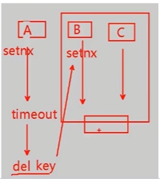

# 库存的超卖问题

# 1. 超卖原因

1. 一个用户同时发出了多个请求，如果库存足够，没加限制，用户就可以下多个订单
2. 减库存的sql上没有加库存数量的判断，并发的时候也会导致把库存减为负数

# 2. 解决方法

## 2.1 redis + mq + mysql

方案：`redis + mq + mysql`保证库存安全，满足高并发处理，但相对复杂。

思路：

1. 在后端的秒杀表中，对`user_id`和`goods_id`加唯一索引，确保一个用户对一个商品绝不会生成两个订单
2. 减库存的sql上加上库存数量的判断

数据库自身是有行级锁的，每次减库存的时候判断stock_count > 0，它实际上是串行的执行update，因此绝对不会超卖。

```mysql
UPDATE seckill_goods SET stock_count = stock_count-1 WHERE goods_id=#{goodsId} AND stock_count > 0
```

```java
// 判断是否重复秒杀
// 从redis中取缓存，减少数据库的访问
SeckillOrder order = redisService.get(OrderKeyPrefix.SK_ORDER, ":" + user.getUuid() + "_" + goodsId, SeckillOrder.class);
// 如果缓存中不存该数据，则从数据库中取
if (order == null) {
    order = orderService.getSeckillOrderByUserIdAndGoodsId(user.getUuid(), goodsId);
}
if (order != null) {
    return Result.error(CodeMsg.REPEATE_SECKILL);
}

// 通过内存标记，减少对redis的访问，秒杀未结束才继续访问redis
Boolean over = localOverMap.get(goodsId);
if (over)
    return Result.error(CodeMsg.SECKILL_OVER);

// 预减库存，同时在库存为0时标记该商品已经结束秒杀
Long stock = redisService.decr(GoodsKeyPrefix.GOODS_STOCK, "" + goodsId);
if (stock < 0) {
    localOverMap.put(goodsId, true);// 秒杀结束。标记该商品已经秒杀结束
    redisService.set(GoodsKeyPrefix.GOODS_STOCK, "" +goodsId, 0);
    return Result.error(CodeMsg.SECKILL_OVER);
}

// 商品有库存且用户为秒杀商品，则将秒杀请求放入MQ
SkMessage message = new SkMessage(user.getUuid(),goodsId);

// 放入MQ(对秒杀请求异步处理，直接返回)
sender.sendSkMessage(message);

// 排队中
return Result.success(0);
```


### 2.1.1 存在的问题(缺陷)

- 由于是通过异步队列写入数据库中，可能存在数据不一致


可能存在少卖的问题，Redis预减库存成功，但是DB扣减库存失败。

Redis在预减库存的时候，在初始化的时候就放置库存的大小，redis的原子减操作保证了多少库存就会减多少，也就会在消息队列中放多少。

现在考虑两种情况：

1. 数据库出现非库存原因比如网络等造成减库存失败，而这时redis已经减了
2. 万一一个用户发出多个请求，而且这些请求恰好比别的请求更早到达服务器，如果库存足够，redis就会减多次，redis提前进入卖空状态，并拒绝。

不过这两种情况出现的概率都是非常低的。


**如何解决少卖问题?**

两种情况都会出现少卖的问题，实际上也是**缓存和数据库出现不一致的问题**。

但是我们不是非得解决不一致的问题，本身使用缓存就难以保证强一致性，在redis设置库存比真实库存多一些就行。

### 2.1.2 怎么保证redis缓存和数据库的一致性？

在其它一般读大于写的场景，一般处理的原则是：缓存只做失效，不做更新。

采用Cache-Aside pattern:

失效：应用程序先从cache取数据，没有得到，则从数据库中取数据，成功后，放到缓存中。

更新：先把数据存到数据库中，成功后，再让缓存失效。

### 2.1.3 Redis库存如何与DB中的库存保持一致？

Redis中的数量不是库存，它的作用仅仅时候只是为了阻挡多余的请求透传到db，起到一个保护DB的作用。因为秒杀商品的数量是有限的，比如只有10个，让1万个请求去访问DB是没有意义的，因为最多只有10个请求会下单成功，剩余的9990个请求都是无效的，是可以不用去访问db而直接失败的。

## 2.2 redis分布式锁

采用redis分布式锁限制同一个客户多次购买

### 2.2.1 分布式锁条件

多进程可见、互斥、可重入锁

- 多进程可见

  synchronized和lock也是锁，但它们是线程级别的，在同一个JVM中。而微服务中，多个服务配合完成业务，如下订单扣库存就涉及到订单服务和库存服务，它们是部署在不同JVM上的，是进程级别的。而redis或zookeeper这样的第三方程序可以满足充当分布式锁。

- 互斥

  同一时间只能有一个进程获取锁标记，可以通过redis的setnx实现，只有在第一次执行时才会成功返回，其它情况返回0


sexnx存在的问题：

如果一个客户端设置了锁，但是没有执行del释放锁，那么在redis中其它客户端将无法再设置这个锁。

如果使用expire失效时间，想让这把锁在一定时间后失效是否可以保证锁的释放？

不可以，因为这是两个命令设置锁setnx和使锁失效expire，这就需要保证原子性。在redis中提供了新指令，保证这两个命令的原子性。

```
set test abc ex 60 nx

# 设置key为test,value为abc,过期时间为60秒,nx表示这个key不存在时才插入
```


### 2.2.2 使用redis分布式锁

直接使用`set key value [EX seconds] [PX milliseconds] [NX|XX]`命令

```
EX seconds：设置失效时长，单位秒
PX milliseconds：设置失效时长，单位毫秒
NX：key不存在时设置value，成功返回OK，失败返回(nil)
XX：key存在时设置value，成功返回OK，失败返回(nil)
```

**存在的问题：**



有三个线程A，B，C，当A线程获取锁后,在执行时出问题,没有再执行下去,超时后锁释放,此时B发现可以获取锁,则B会进行加锁。但此时A线程恢复了,继续执行del释放锁,但此时线程A释放的是线程B创建的锁,所以会导致线程B的锁没有了,线程C发现没有锁后就会执行,这就导致线程B和C同时执行,操作共享资源,又会出现线程不安全的问题。


**如何解决？**

获取当前线程的currentThread,获取本线程唯一的标识 requesteId(可以是一个随机数),A线程在删除锁时要判断是否是自己加的锁,不是就不可以删除。


`获取锁`

```java
// 加锁
String uniqueValue = UUIDUtil.uuid() + "-" + Thread.currentThread().getId();
String lockKey = "redis-lock" + userModel.getPhone();
boolean lock = dLock.lock(lockKey, uniqueValue, 60 * 1000);


public boolean lock(String lockKey, String uniqueValue, int expireTime) {

        Jedis jedis = null;

        try {
            jedis = jedisPool.getResource();
            // 获取锁
            String result = jedis.set(lockKey, uniqueValue, SET_IF_NOT_EXIST, SET_WITH_EXPIRE_TIME, expireTime);

            if (LOCK_SUCCESS.equals(result)) {
                return true;
            }
            return false;
        } finally {
            if (jedis != null)
                jedis.close();
        }
    }
```


`释放锁`

```java
boolean unlock = dLock.unlock(lockKey, uniqueValue);

/**
     * 使用Lua脚本保证解锁的原子性
     *
     * @param lockKey     锁
     * @param uniqueValue 能够唯一标识请求的值，以此保证锁的加解锁是同一个客户端
     * @return
     */
    public boolean unlock(String lockKey, String uniqueValue) {
        Jedis jedis = null;
        try {
            jedis = jedisPool.getResource();
            // 使用Lua脚本保证操作的原子性
            String script = "if redis.call('get', KEYS[1]) == ARGV[1] then " +
                    "return redis.call('del', KEYS[1]) " +
                    "else return 0 " +
                    "end";
            Object result = jedis.eval(script, Collections.singletonList(lockKey), Collections.singletonList(uniqueValue));

            if (RELEASE_SUCCESS.equals(result)) {
                return true;
            }
            return false;
        } finally {
            if (jedis != null)
                jedis.close();
        }
    }
```

